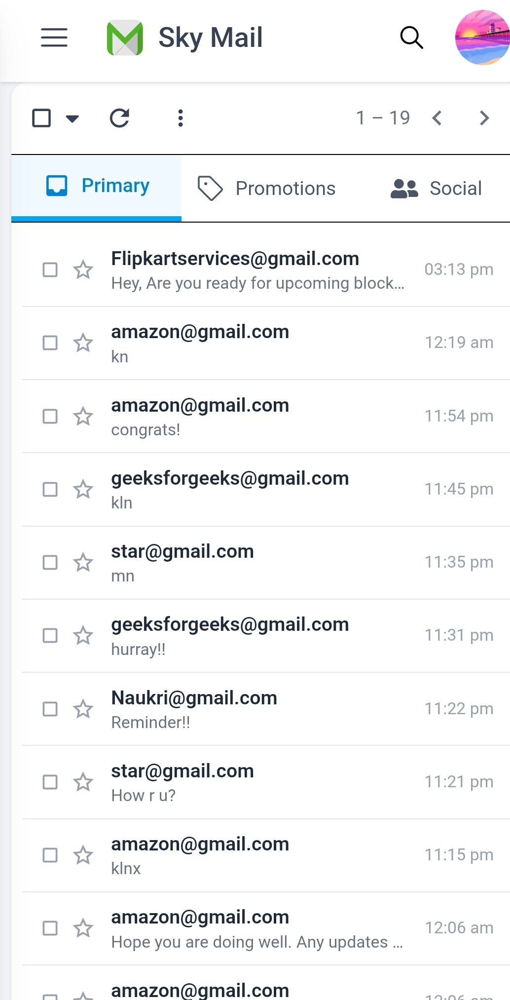
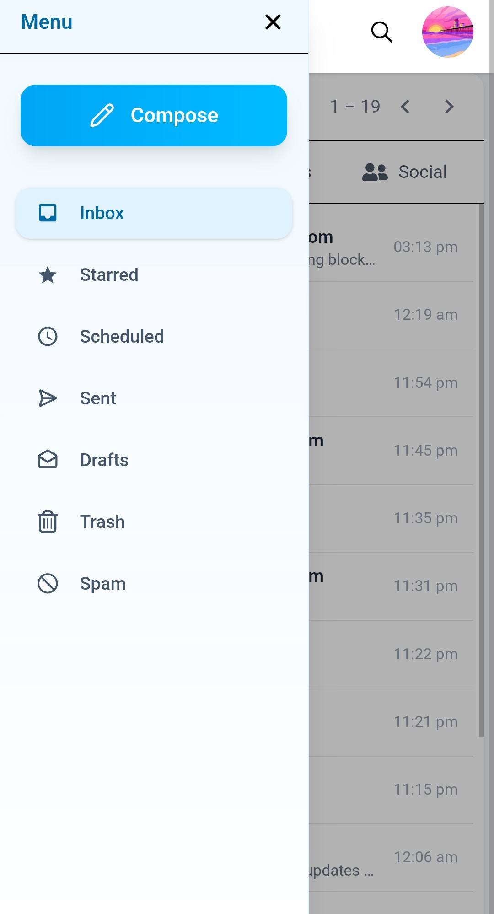
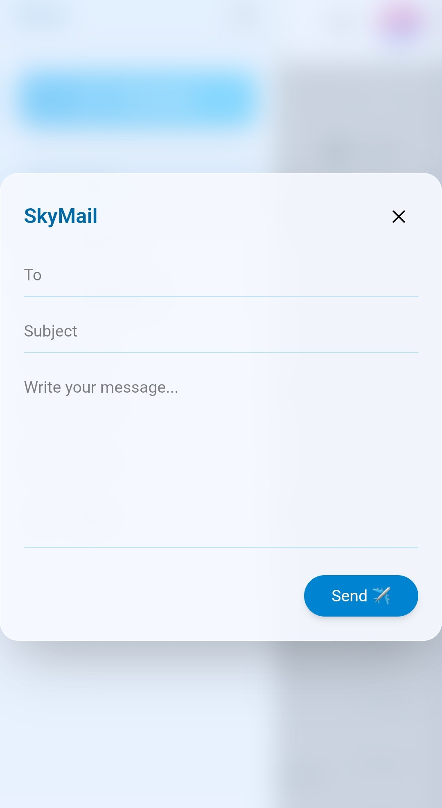

# ✉️ Sky Mail

A modern, fast & secure email client built with React and Firebase — inspired by Gmail.
Compose, receive, and manage emails in real time with Google authentication.

🔗 **[Live Demo](https://sky-mail-787d2.web.app/)**

---

## Screenshots

| Login | Inbox |
|-------|-------|
|  |  |

| Sidebar | Compose |
|---------|---------|
|  |  |

---

## Features

- 🔐 Google Sign-In via Firebase Auth
- 📥 Real-time inbox powered by Firestore
- 📂 Full sidebar — Inbox, Sent, Starred, Drafts, Trash, Spam
- ✏️ Compose window with To, Subject & Message fields
- 📄 Paginated email list
- ☁️ Deployed and live on Firebase Hosting

## Tech Stack

| Layer | Tech |
|-------|------|
| Frontend | React, Vite |
| Styling | CSS |
| Auth | Firebase Authentication (Google) |
| Database | Cloud Firestore |
| Deployment | Firebase Hosting |

## Getting Started

```bash
git clone https://github.com/Esthercodes643/Sky-Mail.git
cd Sky-Mail
npm install
```

Create a `.env` file in the root and add your Firebase config:

```env
VITE_API_KEY=your_api_key
VITE_AUTH_DOMAIN=your_auth_domain
VITE_PROJECT_ID=your_project_id
VITE_STORAGE_BUCKET=your_storage_bucket
VITE_MESSAGING_SENDER_ID=your_sender_id
VITE_APP_ID=your_app_id
```

```bash
npm run dev
```

> ⚠️ Never commit your `.env` file. It's already in `.gitignore`.

---

Built by [Esther](https://github.com/Esthercodes643) 🚀
